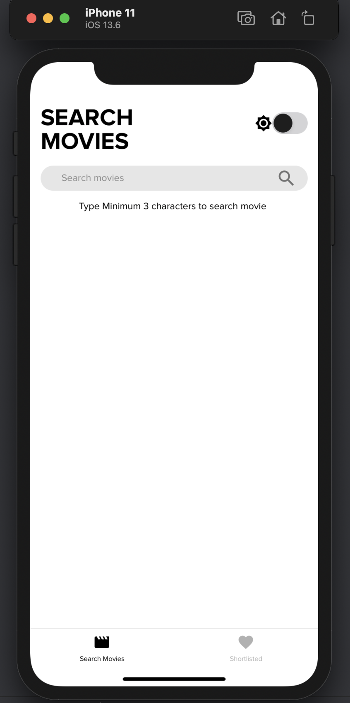
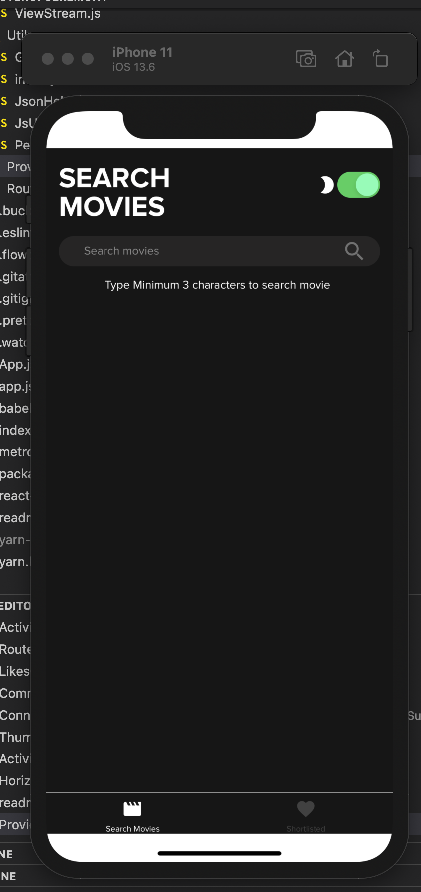
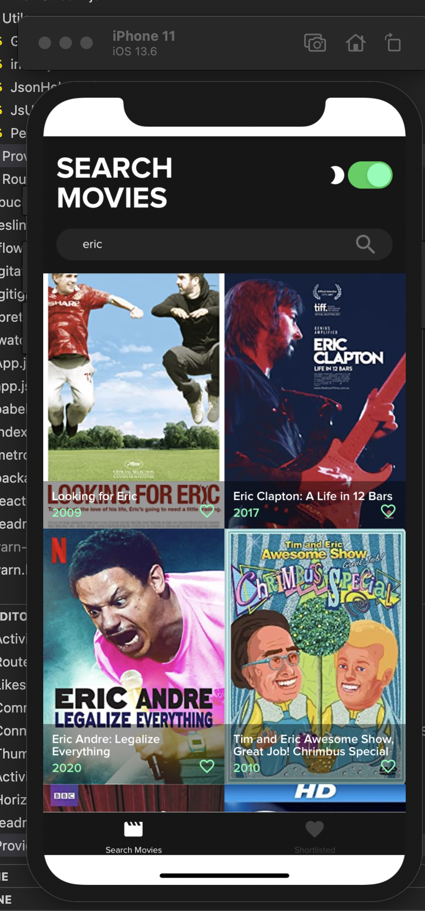
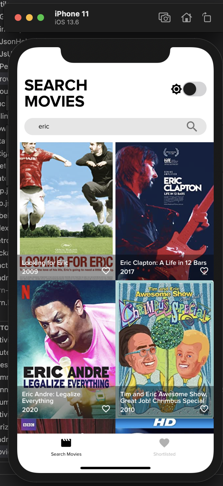
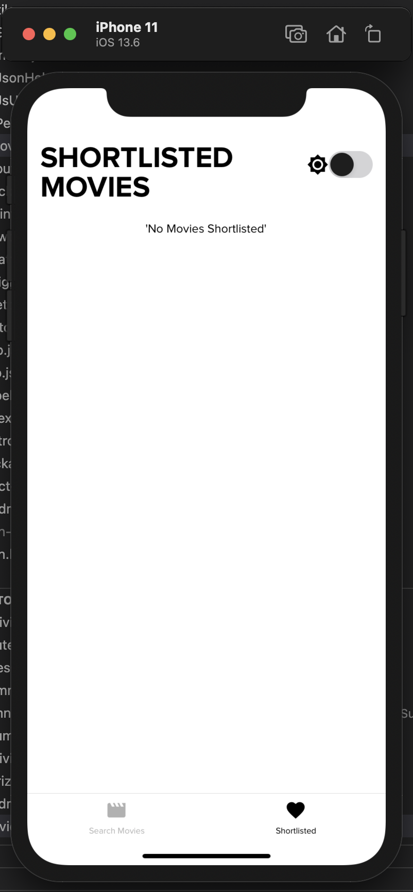
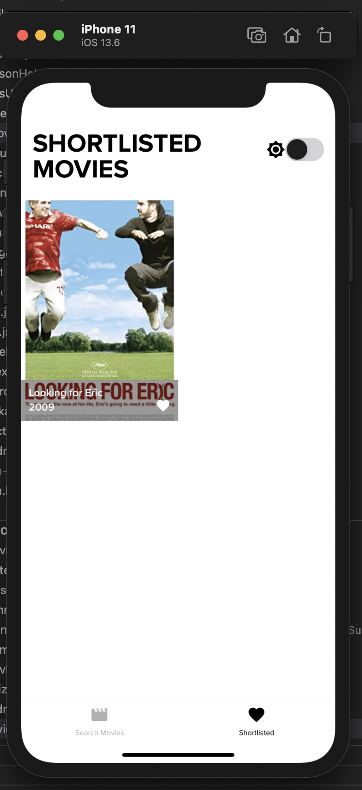

# Installation Guide

Following is a quickstart guide to get you started

- [1. Environment Setup](#1environment-setup)
- [2. Clone and Install](#2-clone-and-install)
- [2.1 Clone the repository](#21-clone-the-repository)
- [2.2 Install dependencies](#22-install-dependencies)
- [3. Running the app](#3-running-the-app)
- [4. Screenshots](#4-Screenshots)
- [5. TroubleShooting](#5-troubleshooting)

## 1.Environment Setup

Make sure you have setup environment before cloning the repository

- Go to [React Native Setup Guide](https://facebook.github.io/react-native/docs/getting-started)
- Make sure you have selected **React Native CLI Quickstart**
- Select your **Development OS** and **Target OS**
- Follow the instructions and make sure your machine is ready for react native development.

## 2. Clone and Install

### 2.1 Clone the repository

Clone the repository

### 2.2 Install dependencies

Install the dependencies that are required to run the project. run the following command in the shell:

```bash
cd react-native-flatlist-grid
yarn install

//only for mac
cd ios && pod install
```

### 3. Running the app

After installing all the dependencies, we need to run the following command:

For android

```
npx react-native run-android
```

For iOS (For MacOs only)

```
npx react-native run-ios
```

The above command opens up a emulator via android studio, and ios simulator in macOS. if all goes well you will be able to see the app run. Cheers.

### 4. Screenshots








### 5. TroubleShooting

Run the following command to clean the build.

```
npx react-native-clean-project --remove-iOS-build --remove-iOS-pods
```
